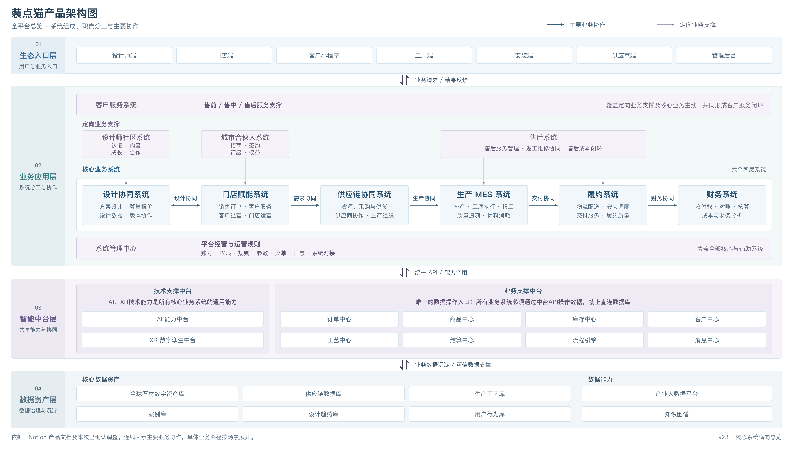

# 装点猫产品架构

## 现阶段最终版

2026-09-15 用户确认 **v23** 为现阶段最终架构图。架构未调整时，要求“输出架构图”即直接展示以下原图，保持布局、文字和连线；图面不添加“目标架构”字样或额外图例。

[可缩放 SVG 原图](architecture/zdm-product-architecture-v23.svg)

## 权威文档

- [装点猫产品架构](https://app.notion.com/p/39f572fed032804f8bf1d6d2e48e1c9a)：最终原图、四层结构与架构约束。
- [装点猫架构协同关系与供货场景](https://app.notion.com/p/3dc572fed032819aa21ee1a095e9018f)：R01—R20、门店现货、供应商共享商品直发、加工生产三类场景，以及尚待细化事项。
- [装点猫模块目录](https://app.notion.com/p/39f572fed0328059b35cfb8ce17baf83)：6个核心系统和5个辅助系统。
- [装点猫业务应用层说明](https://app.notion.com/p/3ab572fed032817c9458e302104be91d)：各系统职责与支撑关系。
- [技术分层与实现边界](platform-architecture.md)：产品架构与模块化单体实现的对应。

## 原图与记录维护

- [定版索引](architecture/current.json) 保存原文件路径和 SHA256；PNG、SVG 与用户确认文件逐字节一致。
- [协同关系镜像](architecture/product-architecture-relations.json) 保存已确认关系和场景，用于稳定复用与校验；它与 Notion 配套文档同步维护，不从总览图重新推导规则。
- 总览图突出系统全貌和主要协作，具体条件及未画出的关系由配套文档承担。关系清单中的订单、门店内部处理、供应商主体不代表新增核心业务系统。
- 架构调整时生成新版本，用户确认后再更新定版索引，保留历史版本。本次同步不修改图面，也不执行系统实现或功能迁移。
